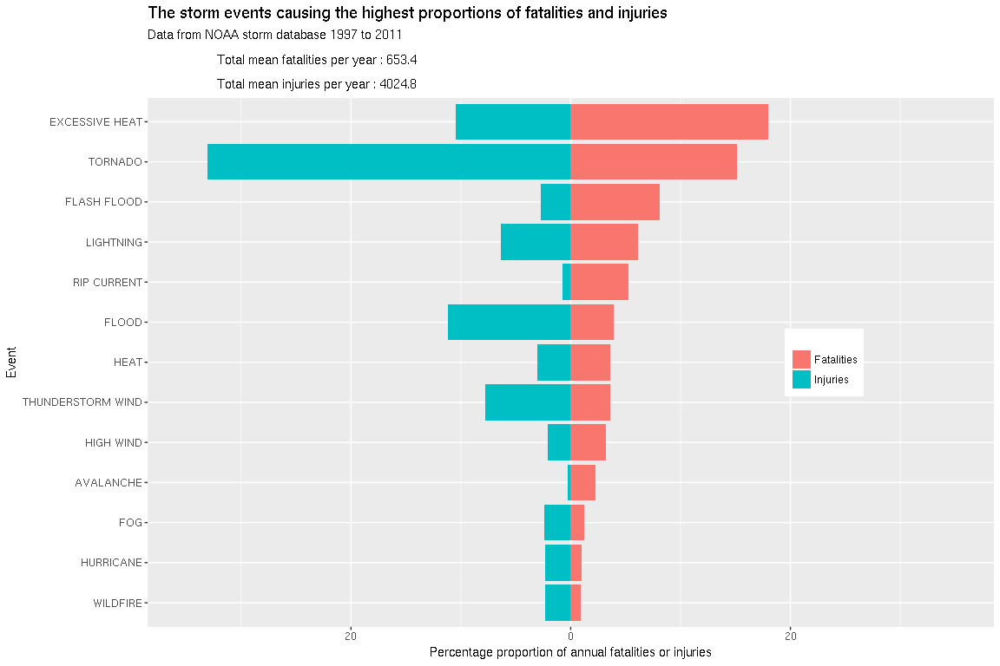

# Reproducible Research: Peer Assessment 2

# Weather events most harmful to population health and economic damage in the United States, 1997 to 2011

## Synopsis

The three major causes of weather-related mortality and morbidity in the United States are **excessive heat** (18.0%), **tornados** (15.2%) and **flash flooding** (8.1%). Similar events are also among the three major causes of storm-related injuries (**tornados** 33.0%, **flood** 11.2% and **excessive heat** 10.5%).

Total weather-related fatalities are approximately 650 deaths annually.
There are approximately 4025 storm-related injuries annually.

The three weather-related events causing the most economic damage are **flood** (34.3%), **hurricanes** (21.2%) and **storm surges** (15.0%). Total annual economic damage totals approximately $28.7 billion per year.

Crop damage, which is a subset of total economic damage, is also significantly affected by **drought**, which causes about 36% of the total $2.4 billion of weather-related crop damage occurring annually.

Data sourced from NOAA (National Weather Service), 1950-2011.

## Data Processing


```r
### start necessary libraries
library(tidyverse)
library(dplyr)
library(lubridate)
library(rlist)
library(gdata)
library(ggplot2)
library(knitr)

### set figure save path to figure/
knitr::opts_chunk$set(fig.path = 'figure/')
knitr::opts_chunk$set(fig.width=12, fig.height=8) 
```

### Download data

Storm Data is from the National Weather Service.

Documentation for the data can be found at the [National Weather Service](https://d396qusza40orc.cloudfront.net/repdata%2Fpeer2_doc%2Fpd01016005curr.pdf) and [National Climatic Data Center Storm Events FAQ](https://d396qusza40orc.cloudfront.net/repdata%2Fpeer2_doc%2FNCDC%20Storm%20Events-FAQ%20Page.pdf)

Data comes in the form of a comma-separated-value file compressed via the bzip2 algorithm.


```r
### download data ZIP file if necessary, and extract if necessary
if (!file.exists('StormData.csv.bz2')) {
  if (download.file('https://d396qusza40orc.cloudfront.net/repdata%2Fdata%2FStormData.csv.bz2','StormData.csv.bz2')) {
    stop('Unable to download data file')
  }
}

StormData <- as.tibble(read.csv(bzfile('StormData.csv.bz2')))
```

Variables of interest

Variable    | Description                 
------------|-----------------------------
BGN_DATE    | date of event starting
BGN_TIME    | time of event starting
TIME_ZONE   | time zone of event
COUNTYNAME  | name of county
STATE       | state of the United States
EVTYPE      | type of event
FATALITIES  | number of fatalities        
INJURIES    | number of injuries
PROPDMG     | value of property damage in dollars
PROPDMGEXP  | property damage dollar multiplier (K thousands, M millions, B billions)
CROPDMG     | value of crop damage in dollars
CROPDMGEXP  | crop damage dollar multiplier (K thousands, M millions, B billions)
REFNUM      | unique reference number for event


### Extract times of storm commencement

Extract time information from **BGN_DATE**, **BGN_TIME** and **TIME_ZONE**, and store in **BEGIN_TIME**.


```r
### Information in BGN_TIME is not consistently stored
### some are in four-digit format e.g. '0000', '1300', '2350'. there is even one three-digit '000'
### others are in 11-character format e.g. '03:25:00 PM'
### convert all to 11-character format

StormData$BGN_calcTIME <- ifelse(str_length(StormData$BGN_TIME)<=4,
                             strftime(strptime(StormData$BGN_TIME,'%H%M'),'%I:%M:%S %p'),
                             as.character(StormData$BGN_TIME))
### more times which are in 'invalid' AM/PM format
### e.g. 15:30:00 PM, or 00:00:10 AM
### re-interpret these as 24-hour times
invalid.time.list <- is.na(strptime(StormData$BGN_calcTIME,'%I:%M:%S %p'))
StormData$BGN_calcTIME[invalid.time.list] <- 
  strftime(strptime(StormData[invalid.time.list,]$BGN_calcTIME,'%H:%M'), '%I:%M:%S %p')

### some times still remain invalid
kable(StormData[is.na(StormData$BGN_calcTIME),c('BGN_TIME','COUNTYNAME','STATE','REFNUM')],
      title = 'Invalid times to be manually adjusted')
```


BGN_TIME   COUNTYNAME         STATE    REFNUM
---------  -----------------  ------  -------
1990       SCREVEN            GA       197399
9999       OHZ060 - 070>078   OH       223421
2090       FAIRFAX            VA       244548
1580       KENOSHA            WI       247251
0572       WASHINGTON         WI       247767
13O0       PRZ001             PR       248507

```r
### these times are 'impossible' e.g. 19:90 hr, or sometimes subsituted a '0 (zero)' for 'O (letter)'
### manually adjust these times, assuming simple transposition or substitution errors
StormData$BGN_calcTIME[StormData$REFNUM == 197399] <- '07:09:00 PM' ### was 1990
StormData$BGN_calcTIME[StormData$REFNUM == 223421] <- '12:01:00 AM' ### was 9999
StormData$BGN_calcTIME[StormData$REFNUM == 244548] <- '08:09:00 PM' ### was 2090
StormData$BGN_calcTIME[StormData$REFNUM == 247251] <- '03:08:00 PM' ### was 1580
StormData$BGN_calcTIME[StormData$REFNUM == 247767] <- '05:27:00 AM' ### was 0572
StormData$BGN_calcTIME[StormData$REFNUM == 248507] <- '01:00:00 PM' ### was 13O0

StormData$BEGIN_TIME <- as.POSIXct(strptime(paste(sub(' .*','',StormData$BGN_DATE),
                                       StormData$BGN_calcTIME),'%m/%d/%Y %I:%M:%S %p'))
```

#### **TIME_ZONE** information, in particular, requires tidying up and adjustment.

List all current timezones, and standardize capitalization


```r
kable(unique(StormData$TIME_ZONE))
```


|x   |
|:---|
|CST |
|EST |
|PST |
|MST |
|CDT |
|PDT |
|EDT |
|UNK |
|HST |
|GMT |
|MDT |
|AST |
|ADT |
|CSt |
|ESt |
|CSC |
|SCT |
|ESY |
|UTC |
|SST |
|AKS |
|GST |

```r
### some timezone names use 'lower-case' characters, convert all to upper-case
StormData$TIME_ZONE <- as.factor(toupper(StormData$TIME_ZONE))
```


```r
kable(StormData[StormData$TIME_ZONE %in% c('UNK','CSC','ESY','SCT'), c('COUNTYNAME','STATE','TIME_ZONE','REFNUM')],
      title = 'List of records with dubious timezone names')
```


COUNTYNAME                                                       STATE   TIME_ZONE    REFNUM
---------------------------------------------------------------  ------  ----------  -------
OCONEE                                                           GA      UNK           23087
HAWAII                                                           HI      UNK           27702
COLES                                                            IL      UNK           30669
RUSH                                                             IN      UNK           35244
HAMPDEN                                                          MA      UNK           67899
LOVE                                                             OK      UNK          120704
PERKINS                                                          SD      UNK          143198
MCLENNAN                                                         TX      UNK          154637
ARMSTRONG                                                        TX      UNK          160236
CHICKASAW                                                        IA      CSC          200720
IAZ033 - 034 - 045>052 - 057>068 - 070>078 - 081>089 - 092>099   IA      SCT          201257
CAMBRIA                                                          PA      ESY          229824
SHAWANO                                                          WI      SCT          247612

#### Correct/adjust timezones.

Convert 'daylight saving' timezones to 'standard' timezones, as Lubridate adjusts for daylight saving times automatically.


```r
### replace missing timezones 'UNK'
### Oconee County, Georgia
StormData$TIME_ZONE[StormData$REFNUM == 23087] <- 'EST'
### Hawaii country, Hawaii
StormData$TIME_ZONE[StormData$REFNUM == 27702] <- 'HST'
### Coles county, Illinois
StormData$TIME_ZONE[StormData$REFNUM == 30669] <- 'CST'
### Rush County, Indiana
StormData$TIME_ZONE[StormData$REFNUM == 35244] <- 'EST'
### Hampden County, Massachusetts
StormData$TIME_ZONE[StormData$REFNUM == 67899] <- 'EST'
### Love County, Oklahoma
StormData$TIME_ZONE[StormData$REFNUM == 120704] <- 'CST'
### Perkins County, South Dakota
StormData$TIME_ZONE[StormData$REFNUM == 143198] <- 'MST'
### McLennan County, Texas
StormData$TIME_ZONE[StormData$REFNUM == 154637] <- 'CST'
### Armstrong, Texas
StormData$TIME_ZONE[StormData$REFNUM == 160236] <- 'CST'

### Chickasaw, Mississippi. likely mistaken timezone 'CSC'
StormData$TIME_ZONE[StormData$REFNUM == 200720] <- 'CST'
### Cambria, Pennsylvania, likely mistaken timezone 'ESY'
StormData$TIME_ZONE[StormData$REFNUM == 229824] <- 'EST'
### Shawano, Wisconsin, likely mistaken timezone 'SCT'
StormData$TIME_ZONE[StormData$REFNUM == 247612] <- 'CST'
### IAZ033, Indiana, likely mistaken timezone 'SCT'
StormData$TIME_ZONE[StormData$REFNUM == 201257] <- 'EST'

### convert daylight saving timezones to 'standard' time
StormData$TIME_ZONE[StormData$TIME_ZONE == 'ADT'] <- 'AST'
StormData$TIME_ZONE[StormData$TIME_ZONE == 'CDT'] <- 'CST'
StormData$TIME_ZONE[StormData$TIME_ZONE == 'EDT'] <- 'EST'
StormData$TIME_ZONE[StormData$TIME_ZONE == 'MDT'] <- 'MST'
StormData$TIME_ZONE[StormData$TIME_ZONE == 'PDT'] <- 'PST'
```

Adjust **BEGIN_TIME** according to **TIME_ZONE**.


```r
### adjust time zones. roll=TRUE prevents 'NA' times as result of daylight savings
StormData[StormData$TIME_ZONE == 'AKS',]$BEGIN_TIME <- 
  force_tz(StormData[StormData$TIME_ZONE == 'AKS',]$BEGIN_TIME, tzone = 'America/Anchorage', roll = TRUE)
StormData[StormData$TIME_ZONE == 'AST',]$BEGIN_TIME <- 
  force_tz(StormData[StormData$TIME_ZONE == 'AST',]$BEGIN_TIME, tzone = 'America/Halifax', roll = TRUE)
StormData[StormData$TIME_ZONE == 'CST',]$BEGIN_TIME <- 
  force_tz(StormData[StormData$TIME_ZONE == 'CST',]$BEGIN_TIME, tzone = 'America/Chicago', roll = TRUE)
StormData[StormData$TIME_ZONE == 'EST',]$BEGIN_TIME <- 
  force_tz(StormData[StormData$TIME_ZONE == 'EST',]$BEGIN_TIME, tzone = 'America/New_York', roll = TRUE)
StormData[StormData$TIME_ZONE == 'HST',]$BEGIN_TIME <- 
  force_tz(StormData[StormData$TIME_ZONE == 'HST',]$BEGIN_TIME, tzone = 'Pacific/Honolulu', roll = TRUE)
StormData[StormData$TIME_ZONE == 'MST',]$BEGIN_TIME <- 
  force_tz(StormData[StormData$TIME_ZONE == 'MST',]$BEGIN_TIME, tzone = 'America/Denver', roll = TRUE)
StormData[StormData$TIME_ZONE == 'PST',]$BEGIN_TIME <- 
  force_tz(StormData[StormData$TIME_ZONE == 'PST',]$BEGIN_TIME, tzone = 'America/Los_Angeles', roll = TRUE)
StormData[StormData$TIME_ZONE == 'SST',]$BEGIN_TIME <- 
  force_tz(StormData[StormData$TIME_ZONE == 'SST',]$BEGIN_TIME, tzone = 'Pacific/Samoa', roll = TRUE)
### other timezones 'GMT', 'GST', and 'UTC' all appear to be UTC+0, and so left alone
```

### Event synonyms

Some events in **EVTYPE** which appear to be the same are recorded with different names (synonyms)

e.g. 'TSTM WIND', 'THUNDERSTORM WIND', 'THUNDERSTORM WINDS'

These synonyms should be merged.

In this section 'close' synonyms will not be merged e.g. 'MARINE THUNDERSTORM WIND' will not be merged with 'THUNDERSTORM WIND', 'THUNDERSTORM WIND/HAIL' will not be merged into 'THUNDERSTORM WIND' and 'STRONG WIND' will
not be merged into 'WIND', although arguably some of these close synonyms are the same.


```r
### Most events are recorded in capitals ('upper case'), but some are recorded in mixed (upper and lower) case
### Covert all to upper case, strip all numbers, periods and trailing/leading whitespace
### numbers and parentheses are often used to describe sub-types within an event type e.g. size of hail
### there are some subtypes which are not yet merged with this logic e.g. 'G45' sub-types
StormData$EVTYPE <- as.factor(toupper(trimws(gsub('[0-9,.,(,)]+','',StormData$EVTYPE))))

### list of synonyms
synonyms <- list(c('THUNDERSTORM WIND','TSTM WIND','THUNDERSTORM WINDS','THUNDERSTORM WINDSS','THUNDERSTORMS WINDS','THUNDERSTROM WIND','THUNDERTSORM WIND','THUNERSTORM WINDS','TUNDERSTORM WIND','THUNDERSTORM WINS','TSTM WND'),
                 c('MARINE THUNDERSTORM WIND','MARINE TSTM WIND','MARINE TSTM WINDS'),
                 c('HIGH WIND','STRONG WIND','HIGH WINDS','STRONG WINDS'),
                 c('FLASH FLOOD','FLASH FLOODING','FLASH FLOODS'),
                 c('FLOOD','FLOODING'),
                 c('URBAN FLOOD','URBAN FLOODING'),
                 c('WILDFIRE','WILD/FOREST FIRE'),
                 c('RECORD HEAT','RECORD WARMTH'),
                 c('THUNDERSTORM WINDS HAIL','TSTM WIND/HAIL','THUNDERSTORM WINDS/HAIL'),
                 c('WIND GUSTS','GUSTY WIND'),
                 c('TORRENTIAL RAIN','TORRENTIAL RAINFALL'),
                 c('TORNADO','TORNADOS','TORNDAO'),
                 c('WIND','WND'),
                 c('THUNDERSTORM','THUNDERSTORMS'),
                 c('RIP CURRENT', 'RIP CURRENTS'),
                 c('HURRICANE','TYPHOON','HURRICANE/TYPHOON'))

### merge synonyms into one synonym
for (events in synonyms) {
  StormData[as.character(StormData$EVTYPE) %in% events,]$EVTYPE <- events[1]
}
```

### Economic damage value calculations

Calculate 'true' dollar values of economic damage, combining
**PROPDMG** with **PROPDMGEXP** and **CROPDMG** and **CROPDMGEXP**

In [National Weather Service](https://d396qusza40orc.cloudfront.net/repdata%2Fpeer2_doc%2Fpd01016005curr.pdf)
there are only three recognized abbreviations for **PROPDMGEXP** and **CROPDMGEXP**, being 'K' for thousands,
'M' for millions and 'B' for billions.


```r
### convert the property and crop damage variables to true numeric values
StormData <- StormData %>%
  mutate(PropertyValue = PROPDMG * 1000^match(toupper(PROPDMGEXP),c('K','M','B'), nomatch=0)) %>%
  mutate(CropValue = CROPDMG * 1000^match(toupper(CROPDMGEXP),c('K','M','B'), nomatch=0))
```

### Finding data which appears to have been collected consistently with the most recent years

Data has been collected from 1950 to 2011. Has data been consistently collected during this time?
Compare the change in events recorded annually from 1950 to 2011, including the total number of
events and the five most commonly recorded events.


```r
### find the most common event types
frequent.events <- StormData %>%
  count(EVTYPE) %>%
  arrange(desc(n))

# show the twenty most frequent event types
print(head(frequent.events,20))
```

```
## # A tibble: 20 x 2
##    EVTYPE                        n
##    <fct>                     <int>
##  1 THUNDERSTORM WIND        323458
##  2 HAIL                     288761
##  3 TORNADO                   60654
##  4 FLASH FLOOD               54992
##  5 HIGH WIND                 25536
##  6 FLOOD                     25447
##  7 LIGHTNING                 15756
##  8 HEAVY SNOW                15708
##  9 MARINE THUNDERSTORM WIND  11987
## 10 HEAVY RAIN                11742
## 11 WINTER STORM              11433
## 12 WINTER WEATHER             7045
## 13 FUNNEL CLOUD               6845
## 14 WILDFIRE                   4218
## 15 WATERSPOUT                 3797
## 16 URBAN/SML STREAM FLD       3392
## 17 BLIZZARD                   2719
## 18 DROUGHT                    2488
## 19 ICE STORM                  2006
## 20 EXCESSIVE HEAT             1678
```

Plot the yearly event count for the top ten events,
and the total event count (the total event count includes both 'common' and 'uncommon' events)

In order to make comparison easier, the event counts are 'normalized' to the 2011 counts
i.e. the 2011 counts are the 'baseline'.


```r
# the ten most frequent events
most.frequent.events <- as.list(as.character(frequent.events[1:10,]$EVTYPE))

# count the events in 'most.frequent.events' in each year of recording
frequent.event.count <- StormData %>%
  filter(EVTYPE %in% most.frequent.events) %>%
  mutate(event.year = year(BEGIN_TIME)) %>%
  group_by(event.year, EVTYPE) %>%
  summarise(events = n())

# and the total events for each year
yearly.event.count <- StormData %>%
  mutate(event.year = year(BEGIN_TIME)) %>%
  group_by(event.year) %>%
  summarise(events = n())

yearly.event.count[,'EVTYPE'] <- 'TOTAL'

event.count <- bind_rows(frequent.event.count,yearly.event.count)

# 'normalize the events' to the frequency observed in 2011
# store the normalized event count in 'event.norm'
event.count[,'event.norm'] <- NA

for (event in list.append(most.frequent.events,'TOTAL')) {
  event.2011.count <- with(event.count, events[EVTYPE == event & event.year == 2011])
  for (year in with(event.count, event.year[EVTYPE == event])) {
    index <- with(event.count,(EVTYPE == event) & (event.year == year))
    event.count$event.norm[index] <- (event.count$events[index]/event.2011.count)
  }
}

ggplot(data=event.count,aes(x=event.year,y=event.norm,group=EVTYPE, colour=EVTYPE)) +
  geom_line()+geom_point() +
  labs(title = "Ten most frequent storm events by year, and total events, from 1950 to 2011",
       subtitle = "NOAA storm database. Yearly event frequency in comparison to 2011 event frequency") +
  labs(x = "Year", y = "Frequency in comparison to 2011 frequency") +
  guides(fill = guide_legend(title="")) +
  theme(legend.position=c(0.2,0.6))
```

<!-- -->

Many of the frequent events are not recorded in the current form until at the mid-1990s.
'MARINE THUNDERSTORM WIND' is not even recorded until 2001.

Restrict data analysis from 1997 to 2011 (fifteen years in total)


```r
StormSubset <- StormData[year(StormData$BEGIN_TIME)>=1997,
                         c('COUNTYNAME','STATE','EVTYPE','FATALITIES','INJURIES',
                           'PROPDMG','PROPDMGEXP','CROPDMG','CROPDMGEXP',
                           'REFNUM','PropertyValue','CropValue','BEGIN_TIME')]
```


## Results

### Which types of events are most harmful with respect to population health?

Rank the twenty events with the greatest number of fatalities or injuries per year.
Population health harm contained in variables **FATALITIES** and **INJURIES**.


```r
### calculate the sum of fatalities and injuries for each event for each year
HealthSum <- StormSubset %>%
  mutate(event.year = year(BEGIN_TIME)) %>%
  group_by(event.year, EVTYPE) %>%
  summarise(fatalities = sum(FATALITIES), injuries = sum(INJURIES))

### calculate the mean ('average') annual fatalities and injuries for each event
### calculate the proportion of annual fatalities or injuries caused by the event 
HealthMean <- HealthSum %>%
  group_by(EVTYPE) %>%
  summarise(mean_fatalities = mean(fatalities), mean_injuries = mean(injuries)) %>%
  mutate(proportion_fatalities = mean_fatalities/sum(mean_fatalities)*100) %>%
  mutate(proportion_injuries = mean_injuries/sum(mean_injuries)*100) %>%
  arrange(desc(mean_fatalities))

kable(HealthMean[1:20,c('EVTYPE','mean_fatalities','proportion_fatalities')], caption = 'Weather events causing most fatalities, annual mean fatalities, and percentage of fatalities caused by event')
```


Table: Weather events causing most fatalities, annual mean fatalities, and percentage of fatalities caused by event

EVTYPE                     mean_fatalities   proportion_fatalities
------------------------  ----------------  ----------------------
EXCESSIVE HEAT                  117.400000               17.968625
TORNADO                          99.000000               15.152418
FLASH FLOOD                      53.000000                8.111901
LIGHTNING                        39.866667                6.101782
RIP CURRENT                      34.466667                5.275286
FLOOD                            25.466667                3.897794
HEAT                             23.700000                3.627397
THUNDERSTORM WIND                23.266667                3.561073
HIGH WIND                        21.000000                3.214149
AVALANCHE                        14.533333                2.224395
COLD AND SNOW                    14.000000                2.142766
COLD/WIND CHILL                  13.571429                2.077171
EXTREME COLD/WIND CHILL          12.500000                1.913184
WINTER STORM                     11.133333                1.704009
HEAVY SURF/HIGH SURF             10.500000                1.607075
EXTREME COLD                      9.285714                1.421223
FOG                               8.285714                1.268168
TSUNAMI                           8.250000                1.262701
HYPOTHERMIA/EXPOSURE              7.000000                1.071383
HIGH SURF                         6.692308                1.024289

```r
total_mean_fatalities <- sum(HealthMean$mean_fatalities)
sprintf('Total mean number of fatalities annually: %.1f',total_mean_fatalities)
```

```
## [1] "Total mean number of fatalities annually: 653.4"
```

```r
kable(arrange(HealthMean,desc(mean_injuries))[1:20,c('EVTYPE','mean_injuries','proportion_injuries')],caption = 'Weather events causing the most injuries, annual mean injuries and percentage of injuries caused by event')
```


Table: Weather events causing the most injuries, annual mean injuries and percentage of injuries caused by event

EVTYPE                mean_injuries   proportion_injuries
-------------------  --------------  --------------------
TORNADO                  1330.80000            33.0652423
FLOOD                     449.33333            11.1641986
EXCESSIVE HEAT            422.13333            10.4883836
THUNDERSTORM WIND         313.66667             7.7934057
LIGHTNING                 255.06667             6.3374219
HEAT                      122.20000             3.0361982
FLASH FLOOD               108.66667             2.6999471
FOG                        95.71429             2.3781305
WILDFIRE                   94.86667             2.3570704
HURRICANE                  93.50000             2.3231140
HIGH WIND                  84.60000             2.1019834
WINTER STORM               69.46667             1.7259785
GLAZE                      53.00000             1.3168454
HAIL                       42.06667             1.0451943
HEAVY SNOW                 37.86667             0.9408405
WINTER WEATHER MIX         34.00000             0.8447687
TSUNAMI                    32.25000             0.8012880
RIP CURRENT                29.20000             0.7255073
WINTER WEATHER             26.38462             0.6555558
MIXED PRECIP               26.00000             0.6459996

```r
total_mean_injuries <- sum(HealthMean$mean_injuries)
sprintf('Total mean number of injuries annually: %.1f',total_mean_injuries)
```

```
## [1] "Total mean number of injuries annually: 4024.8"
```

Display results graphically of the events causing the most fatalities and injuries


```r
### the (union) of the ten events causing the most fatalities and ten events causing the most injuries
most_health_events <- union(HealthMean$EVTYPE[1:10],arrange(HealthMean,desc(mean_injuries))$EVTYPE[1:10])

### gather data in preparation for bar-charting
HealthImpact <- HealthMean %>%
  filter(HealthMean$EVTYPE %in% most_health_events) %>%
  mutate(Injuries = -proportion_injuries) %>% ### negative values will be used for 'bar-negative-stack' later
  rename(Fatalities = proportion_fatalities) %>%
  select(one_of('EVTYPE','Injuries','Fatalities')) %>%
  gather(key = 'harm', value = 'proportion', Injuries, Fatalities)

# arrange factors by fatality order
HealthImpact$EVTYPE = reorder.factor(HealthImpact$EVTYPE, new.order = arrange(HealthMean,mean_fatalities)$EVTYPE)
arrange(HealthImpact, EVTYPE)
```

```
## # A tibble: 26 x 3
##    EVTYPE    harm       proportion
##    <fct>     <chr>           <dbl>
##  1 WILDFIRE  Injuries       -2.36 
##  2 WILDFIRE  Fatalities      0.888
##  3 HURRICANE Injuries       -2.32 
##  4 HURRICANE Fatalities      0.973
##  5 FOG       Injuries       -2.38 
##  6 FOG       Fatalities      1.27 
##  7 AVALANCHE Injuries       -0.250
##  8 AVALANCHE Fatalities      2.22 
##  9 HIGH WIND Injuries       -2.10 
## 10 HIGH WIND Fatalities      3.21 
## # ... with 16 more rows
```

```r
subtitle <- sprintf('Data from NOAA storm database 1997 to 2011\n
                    Total mean fatalities per year : %.1f\n
                    Total mean injuries per year : %.1f',
                    total_mean_fatalities, total_mean_injuries)  

ggplot(data=HealthImpact, aes(x = EVTYPE, y = proportion, fill = harm)) +
  geom_bar(stat = 'identity') + ### 'identity' needed for values (rather than counts)
  labs(title = "The storm events causing the highest proportions of fatalities and injuries",
       subtitle = subtitle) +
  labs(x = "Event", y = "Percentage proportion of annual fatalities or injuries") +
  scale_y_continuous(labels=abs) + 
                     ### remove negative values for axis for 'negative' part of chart
  guides(fill = guide_legend(title="")) +
  theme(legend.position=c(0.8,0.5)) +
  coord_flip(ylim=c(-35,35))
```

<!-- -->

### Which types of events have the greatest economic consequences?

Rank the twenty events with the greatest value of property or crop damage per year
Economic damage information is stored in **PropertyValue** and **CropValue**.


```r
### remove variables no longer required
DamageSubset <- StormSubset %>%
  select(-c(PROPDMG,PROPDMGEXP,CROPDMG,CROPDMGEXP,FATALITIES,INJURIES))

### calculate the sum of damage for each event for each year
DamageSum <- DamageSubset %>%
  mutate(event.year = year(BEGIN_TIME)) %>%
  group_by(event.year, EVTYPE) %>%
  summarise(property = sum(PropertyValue), crop = sum(CropValue))

### calculate the mean ('average') damage for each event (for each of property and crop)
### calculate the proportion of annual damage caused by event (for each of property and crop)
### and also calculate combined mean damage (property+crop) and proportion
DamageMean <- DamageSum %>%
  group_by(EVTYPE) %>%
  summarise(mean_property = mean(property), mean_crop = mean(crop)) %>%
  mutate(mean_combined = mean_property + mean_crop) %>%
  mutate(proportion_property = mean_property/sum(mean_property)*100) %>%
  mutate(proportion_crop = mean_crop/sum(mean_crop)*100) %>%
  mutate(proportion_combined = mean_combined/sum(mean_combined)*100) %>%
  arrange(desc(mean_property))

kable(DamageMean[1:20,c('EVTYPE','mean_property','proportion_property')], caption = 'Weather events causing most property damage, annual mean property damage, and percentage of property damage caused by event')
```


Table: Weather events causing most property damage, annual mean property damage, and percentage of property damage caused by event

EVTYPE               mean_property   proportion_property
------------------  --------------  --------------------
FLOOD                   9531642097            36.2058371
HURRICANE               5738335644            21.7970045
STORM SURGE             4318594900            16.4041350
TORNADO                 1593155877             6.0515850
FLASH FLOOD              945352367             3.5909105
HAIL                     932133795             3.5406999
STORM SURGE/TIDE         663026857             2.5185002
WILDFIRE                 512436633             1.9464849
TROPICAL STORM           506411703             1.9235993
THUNDERSTORM WIND        497588195             1.8900833
HIGH WIND                354029326             1.3447765
ICE STORM                236839987             0.8996341
WINTER STORM              99690550             0.3786735
DROUGHT                   60713400             0.2306192
LIGHTNING                 47244955             0.1794594
HEAVY RAIN                36684229             0.1393446
TSUNAMI                   36015500             0.1368045
HEAVY SNOW                33396323             0.1268556
BLIZZARD                  32326930             0.1227935
LANDSLIDE                 29507091             0.1120824

```r
total_mean_property <- sum(DamageMean$mean_property)
sprintf('Total mean value of property damage annually: $%.0f',total_mean_property)
```

```
## [1] "Total mean value of property damage annually: $26326258003"
```

```r
kable(arrange(DamageMean,desc(mean_crop))[1:20,c('EVTYPE','mean_crop','proportion_crop')],caption = 'Weather events causing the most crop damage, annual mean crop damage and percentage of crop damage caused by event')
```


Table: Weather events causing the most crop damage, annual mean crop damage and percentage of crop damage caused by event

EVTYPE                     mean_crop   proportion_crop
------------------------  ----------  ----------------
DROUGHT                    857565733        35.8547176
HURRICANE                  357161629        14.9328837
FLOOD                      310131493        12.9665595
EXTREME COLD               162917714         6.8115696
HAIL                       152800840         6.3885843
FROST/FREEZE                99471455         4.1588893
FLASH FLOOD                 84755447         3.5436148
THUNDERSTORM WIND           61726533         2.5807788
HEAVY RAIN                  48544387         2.0296348
TROPICAL STORM              45114067         1.8862136
HIGH WIND                   39428147         1.6484860
EXCESSIVE HEAT              32826800         1.3724845
AGRICULTURAL FREEZE         28820000         1.2049606
WILDFIRE                    26612009         1.1126448
FREEZE                      24370833         1.0189415
TORNADO                     18061054         0.7551304
THUNDERSTORM WINDS HAIL      7164464         0.2995454
HARD FREEZE                  6450000         0.2696737
UNSEASONAL RAIN              5000000         0.2090494
HEAVY SNOW                   4726807         0.1976272

```r
total_mean_crop <- sum(DamageMean$mean_crop)
sprintf('Total mean value of crop damage annually: $%.0f',total_mean_crop)
```

```
## [1] "Total mean value of crop damage annually: $2391779355"
```

```r
kable(arrange(DamageMean,desc(mean_combined))[1:20,c('EVTYPE','mean_combined','proportion_combined')],caption = 'Weather events causing the most economic damage, annual mean economic damage and percentage of economic damage caused by event')
```


Table: Weather events causing the most economic damage, annual mean economic damage and percentage of economic damage caused by event

EVTYPE               mean_combined   proportion_combined
------------------  --------------  --------------------
FLOOD                   9841773590            34.2703558
HURRICANE               6095497272            21.2253268
STORM SURGE             4318594900            15.0379180
TORNADO                 1611216931             5.6104702
HAIL                    1084934635             3.7778857
FLASH FLOOD             1030107814             3.5869715
DROUGHT                  918279133             3.1975693
STORM SURGE/TIDE         663148286             2.3091699
THUNDERSTORM WIND        559314729             1.9476078
TROPICAL STORM           551525770             1.9204856
WILDFIRE                 539048642             1.8770386
HIGH WIND                393457473             1.3700709
ICE STORM                237503987             0.8270203
EXTREME COLD             163610286             0.5697126
FROST/FREEZE             100424182             0.3496903
WINTER STORM             100243950             0.3490627
HEAVY RAIN                85228616             0.2967773
LIGHTNING                 47701395             0.1661026
HEAVY SNOW                38123129             0.1327498
TSUNAMI                   36020500             0.1254281

```r
total_mean_combined <- sum(DamageMean$mean_combined)
sprintf('Total mean economic damage annually: $%.0f',total_mean_combined)
```

```
## [1] "Total mean economic damage annually: $28718037357"
```

Display results graphically of the events causing the most property and crop damage


```r
### the (union) of the ten events causing the most property, crop or combined economic damage
most_damage_events <- Reduce(union, list(DamageMean$EVTYPE[1:10],arrange(DamageMean,desc(mean_combined))$EVTYPE[1:10],
                            arrange(DamageMean,desc(mean_combined))$EVTYPE[1:10]))

### gather data in preparation for bar-charting
DamageImpact <- DamageMean %>%
  filter(DamageMean$EVTYPE %in% most_damage_events) %>%
  rename(Property = proportion_property, Crop = proportion_crop, Combined = proportion_combined) %>%
  select(one_of('EVTYPE','Property','Crop','Combined')) %>%
  gather(key = 'damage', value = 'proportion', Property, Crop, Combined)

### order the event types by the 'mean_combined' economic impact
DamageImpact$EVTYPE <- reorder.factor(DamageImpact$EVTYPE, new.order = arrange(DamageMean,mean_combined)$EVTYPE)
DamageImpact <- arrange(DamageImpact,EVTYPE)

subtitle <- sprintf('Data from NOAA storm database 1997 to 2011\n
                    Total mean property damage per year \t: $%12.0f\n
                    Total mean crop damage per year \t\t: $%12.0f\n
                    Total combined damage per year \t\t: $%12.0f\n',
                    total_mean_property, total_mean_crop, total_mean_combined)  

ggplot(data=DamageImpact, aes(x = EVTYPE, y = proportion, fill = damage)) +
  geom_bar(stat = 'identity', position = 'dodge') + ### 'identity' needed for values (rather than counts)
  ### 'dodge' for side-by-side bar chart
  labs(title = "The storm events causing the highest proportions of economic impact",
       subtitle = subtitle) +
  labs(x = "Event", y = "Percentage proportion of property, crop or combined value of loss") +
  guides(fill = guide_legend(title="")) +
  theme(legend.position=c(0.8,0.6)) +
  coord_flip()
```

<!-- -->
